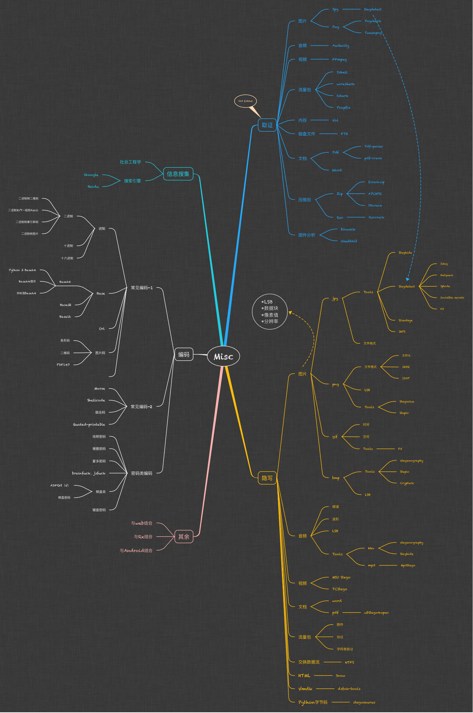

Misc 是英文 Miscellaneous 的前四个字母，杂项、混合体、大杂烩的意思。

Misc 在国外的比赛中其实又被具体划分为各个小块，有

-   Recon
-   Forensic
-   Stego
-   Misc
-   ……

在国内的比赛中，被统一划分入 Misc 领域，有时 Crypto（尤其是古典密码）也被划入其中。

在 Misc 这一章节中，将从以下几个方面介绍这一块的知识：

-   Recon（信息搜集）

    主要介绍一些获取信息的渠道和一些利用百度、谷歌等搜索引擎的技巧

-   Encode（编码转换）

    主要介绍在 CTF 比赛中一些常见的编码形式以及转换的技巧和常见方式

-   Forensic && Stego（数字取证 && 隐写分析）

    隐写取证是 Misc 中最为重要的一块，包括文件分析、隐写、内存镜像分析和流量抓包分析等等，涉及巧妙的编码、隐藏数据、层层嵌套的文件中的文件，灵活利用搜索引擎获取所需要的信息等等。

CTF 中 Misc 与现实中的取证不同，现实中的取证很少会涉及巧妙的编码加密，数据隐藏，被分散嵌套在各处的文件字符串，或是其他脑洞类的
Chanllenge。很多时候是去精心恢复一个残损的文件，挖掘损坏硬盘中的蛛丝马迹,或者从内存镜像中抽取有用的信息。

现实的取证需要从业者能够找出间接的恶意行为证据：攻击者攻击系统的痕迹，或是内部威胁行为的痕迹。实际工作中计算机取证大部分是从日志、内存、文件系统中找出犯罪线索，并找出与文件或文件系统中数据的关系。而流量取证比起内容数据的分析，更注重元数据的分析，也就是当前不同端点间常用 TLS 加密的网络会话。

Misc 是切入 CTF 竞赛领域、培养兴趣的最佳入口。Misc 考察基本知识，对安全技能的各个层面都有不同程度的涉及，可以在很大程度上启发思维。

